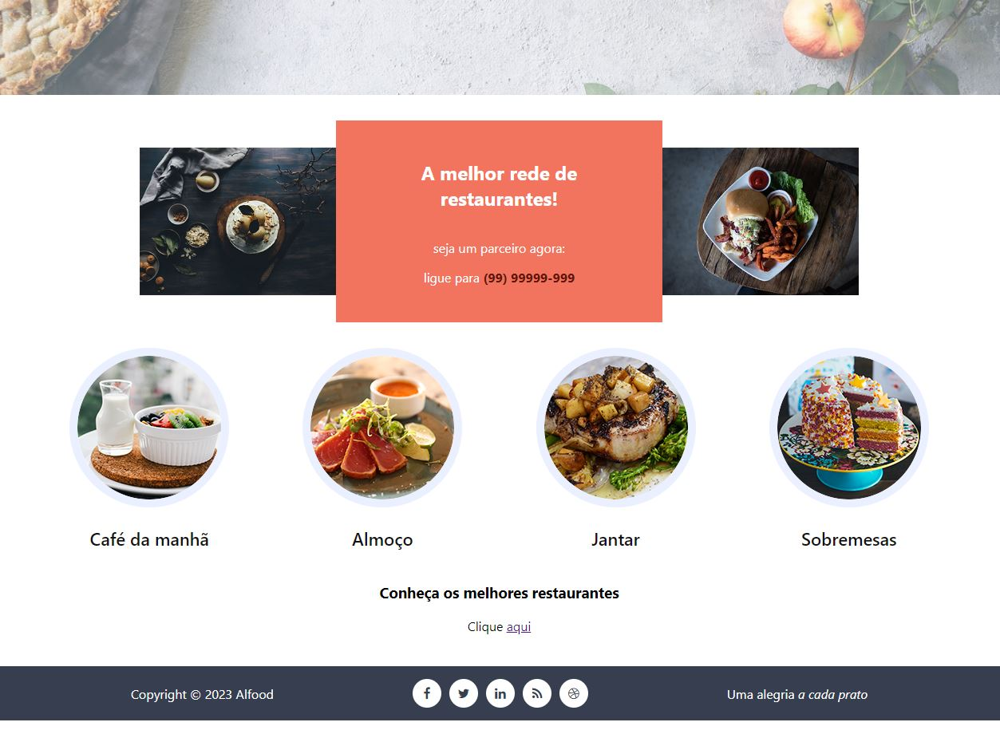
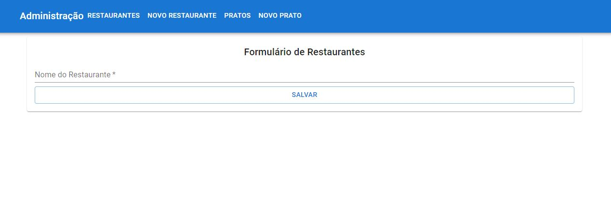
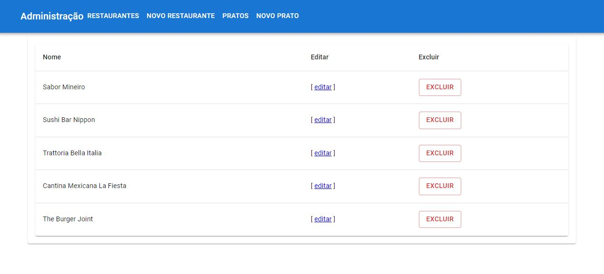
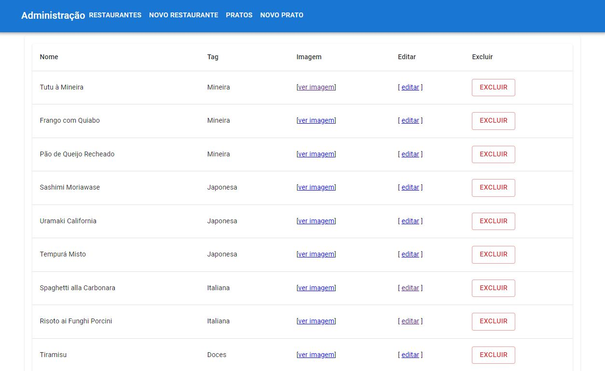
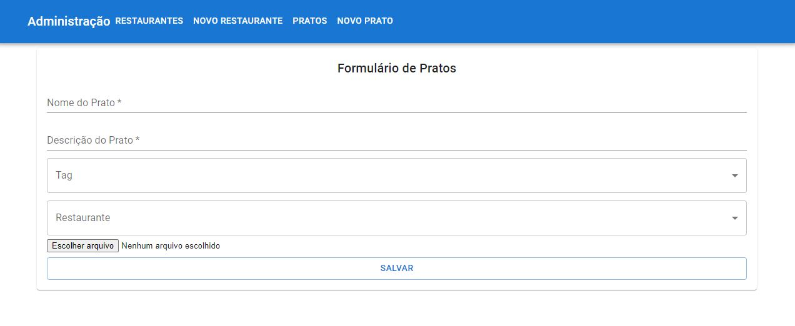
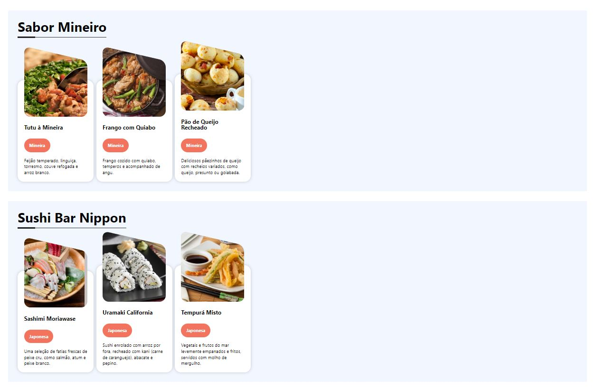
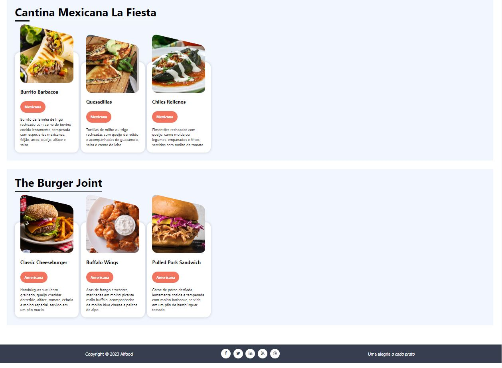

# Alfood Restaurants

This project is a web application developed in React and TypeScript to list restaurants and their dishes. The application includes an administrative panel where users can add, edit and remove restaurants and dishes. Restaurants and dishes added by users are displayed in the web application for customers.

* Demonstrative image:

# Technologies Used for the Backend:

* Docker: Used to create and manage containers that encapsulate the backend application and its dependencies.

* Swagger: Used to document and provide an API reading interface, making it easier for developers to understand and use.

* Axios: Used to make HTTP requests to the backend API.

* MUI: A package of React-ready components and styles that facilitates admin panel UI development.

* REST API: Used to create a communication architecture between the frontend and the backend, following the principles and standards of REST (Representational State Transfer). The REST API defines endpoints (URLs) to perform CRUD (Create, Read, Update, Delete) operations on resources (restaurants and dishes) through HTTP requests.
With the addition of REST API technology, the application benefits from a standardized and scalable approach to communicating between the frontend and backend, allowing data to be transmitted and manipulated efficiently.

* Demonstrative images from the admin panel:

# Technologies Used for the Frontend:

* React: A JavaScript library for building reactive and reusable user interfaces.

* TypeScript: A programming language that adds optional static typing to JavaScript, providing advanced autocompletion, error detection, and refactoring capabilities.

* React Router Dom: A routing library for React that allows creating routes and navigating between components.

* React Hooks: A React feature that allows you to use state and other React features in functional components, without having to write classes.

* Demonstrative images from the admin panel:

# Technologies Used (Summary)

* These technologies were used to build a complete web application, with a frontend in React and TypeScript, a backend running in Docker containers and an administration interface to manage restaurants and dishes. The app provides a user-friendly experience for customers by displaying the restaurants and dishes added through the admin panel.

# How to Use

* 1º - In backend folder

1 - Download and install docker desktop.

2 - Open the back end folder in your operating system's terminal and type the command "docker-compose build" and press enter.

3 - then type and hit enter in the command "docker-compose up".

* 2º - In frontend folder

4 - Install Node.Js 18 (or higher) from the official website https://nodejs.org/, if not installed.

5 - Use the command "npm i" in the terminal to install all necessary dependencies.
    
6 - Use the command "npm start" in the terminal to open the web system in your browser in http://localhost:3000

* 3º - Admin Panel Access

7 - In your browser, type http://localhost:3000/admin

* Observation

- para o acesso à API utilize em seu navegador http://localhost:8000

# Expansion

With this code base, you will be able to further expand the functionalities of this web system, as you will always have functionalities to add and refine errors, test, creating your own functionalities according to your needs.